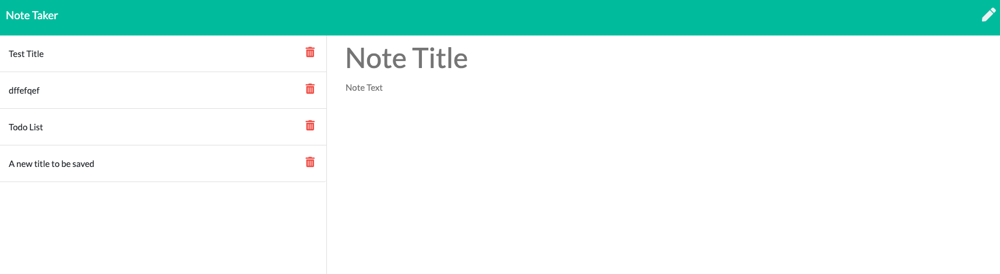
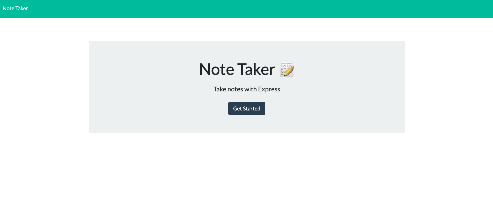

# Unit 11 Express Homework: Note Taker

https://week11-note-taker.herokuapp.com/notes

## Description

Create an application that can be used to write, save, and delete notes. This application will uses express backend and save and retrieve note data from a JSON file.

- The application frontend was created, I built the backend and connected the two.

- The following HTML routes are used:

  - GET `/notes` returns the `notes.html` file. 

* GET `*` returns the `index.html` file. 

- The notes are stored in a `db.json` file on the backend. The `fs` module is used to read and write to this file.

* The following API royes were created:

  - GET `/api/notes` reads the `db.json` file and return all saved notes as JSON. 

  - POST `/api/notes` receives a new note to save on the request.body, add it to the `db.json` file, and then return the new note to the client when the save icon is clicked. Here is the screen shot before saving (with the save icon circled): 

And this is the screen shot after it's been saved, with the title circled: 

- DELETE `/api/notes/:id` receives a query paramter containing the id of a note to delete when the trash can next to the corresponding title is clicked. The note is deleted from the list and from the `db.json` file.

## User Story

AS A user, I want to be able to write and save notes

I WANT to be able to delete notes I've written before

SO THAT I can organize my thoughts and keep track of tasks I need to complete

## Business Context

For users that need to keep track of a lot of information, it's easy to forget or be unable to recall something important. Being able to take persistent notes allows users to have written information available when needed.
